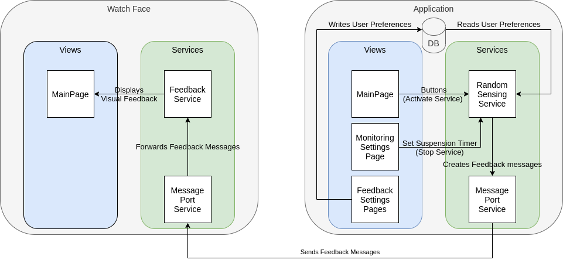

# Lab Course on Computer Security and Privacy - WiSe 2020/2021

## Table Of Contents
This repository contains several projects:
- **SensorFeedback**: Main Application project. Handles sensors activation and forwards feedback messages to the associated Watch Face, depending on user feedback preferences.
- **SensorFeedbackWF**: Watch Face project. Receives feedback mesages from the main app, and generates visual, haptic and/or sonor feedback in different forms. 
- **Monitoring**: archived project, first attempt for this course. Attempted to monitor installed apps to detect sensor usage.
- **Report**: Report for this project, in LaTeX.
- **Presentation**: Powerpoint presentation for this project.

## Application Architecture
The basic structure of the project (Watch Face + App) is as follows:

The folder organisation of the projects is as follows:
- **Models**: Only in the main app. Contains the SQLite database model. It only contains one table/class (UserSettings).
- **res**: Internal resources (accessed by views).
- **Resources**: Contains text that can be refered to in the code. Can also be used to translate the application.
- **Services**: Various services needed to e.g. access the sensors of the watch or manipulate the database.
- **shared/res**: Shared resources (accessed by notifications).
- **Views**: Contains the views. Since we use "code-behind" architecture, each view has a XAML file (view) and an associated C# class.

The applications' entry point is `Main.cs`, which transits to `App.xaml.cs`, then to `AppShel.xaml.cs`. The Shell functionality of Xamarin.Forms then creates the routes for the different views. More on Shell for Tizen [here](https://developer.samsung.com/tizen/blog/en-us/2020/03/09/using-xamarinform-shell-on-galaxy-watch).

## Getting Started
In order to run the applications on a smartwatch, some requirements need to be fulfilled.
1. Install Visual Studio (available for Windows or macOS). For this project, we used VS 2019 Community. Tizen tools are also available for Visual Studio Code, but since the projects were not created with it, we do not recommend this approach.
2. Follow [this guide](https://docs.tizen.org/application/vstools/install/#) to install the development environment.
3. In order to install applications on Samsung hardware, you need to generate and use your own certificate. This is covered in [this guide](https://developer.samsung.com/galaxy-watch-develop/getting-certificates/overview.html).
4. After having cloned the project, open the solutions for the main app (`SensorFeedback`) and the watch face (`SensorFeedbackWF`). Connect the watch to your computer using the Tizen Device Manager (from VS: Tools > Tizen > Device Manager). More details [here](https://docs.tizen.org/application/dotnet/tutorials/testing-your-app-on-gear/).
5. Once the watch is connected, install the apps by building them one after the other.

